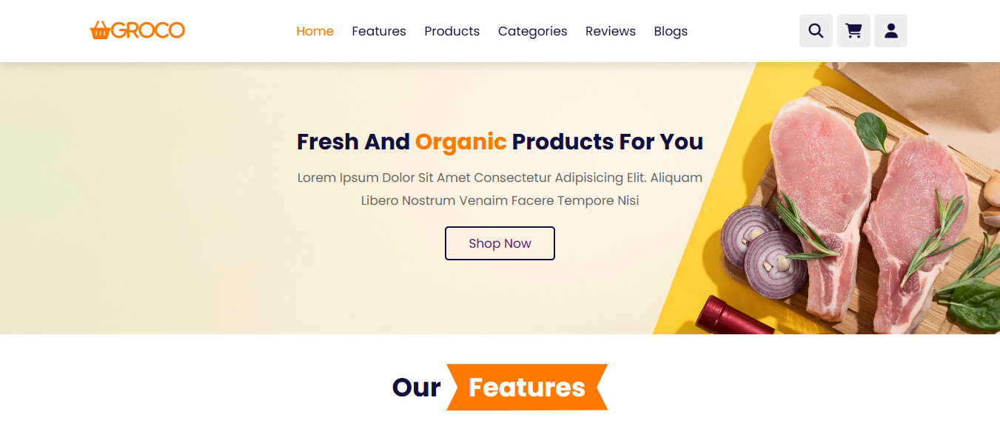
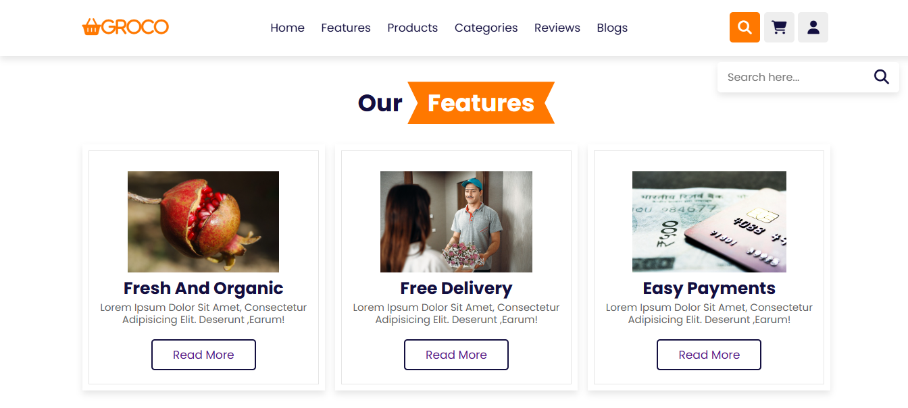
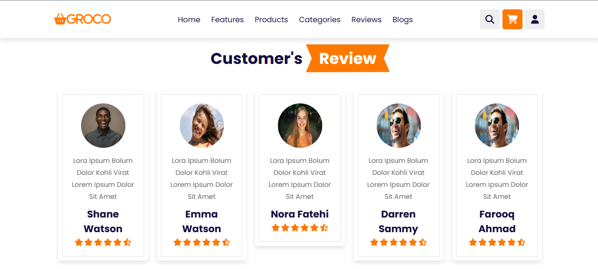
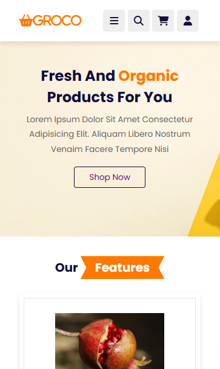
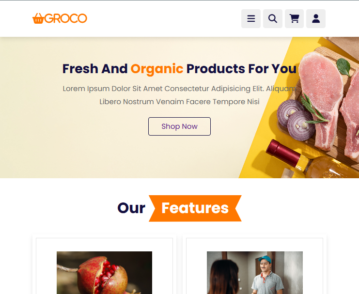

---

# 🛒 Groco

**Groco** is a responsive HTML template for an online grocery store. It features sections for products, categories, customer reviews, blogs, and a shopping cart. The design integrates **Swiper.js** for interactive sliders and **Font Awesome** for icons, offering a clean and modern shopping interface.

---

## 🚀 Features

* 🏠 Home, ✨ Features, 🥦 Products, 📂 Categories, ⭐ Reviews, 📝 Blogs
* 🛍️ Shopping cart and 🔐 login form
* 📱 Fully responsive layout
* 🔄 Swiper.js sliders for products and reviews
* 🎨 Font Awesome icons for clean UI elements

---

## 📂 File Structure

```
groco/
│
├── Css/
│   └── Beauty.css            # Main stylesheet
│
├── images/                   # Product and UI images
│
├── Functionality.js          # Minimal JavaScript interactivity
│
└── view.html                 # Main HTML file
```

---

## 🧰 Getting Started

1. **Clone or download** this repository.
2. Place your image assets in the `images/` folder.
3. Make sure your stylesheet is saved as `Css/Beauty.css`.
4. Open `view.html` in your browser to view the template.

---

## 📦 Dependencies

* [Swiper.js](https://swiperjs.com/) – For sliders
* [Font Awesome](https://fontawesome.com/) – For icons

---

## 🎨 Customization

* 🔧 Replace default text and images with your own content.
* 🎨 Modify layout and styles in `Css/Beauty.css`.
* 💡 Enhance interactivity via `Functionality.js`.

---

## 📸 Screenshots

| Home Page                     | Products Section                      | Cart & Login Form             | Footer             |
| ----------------------------- | ------------------------------------- | ----------------------------- |--------------------|
|        |                    |               |  |
| Mobile View                   | Tab View                              |
| ----------------------------- | --------------------------------------|     
|           |                   |


---

## 📄 License

This project is for **educational/demo purposes** only and is not licensed for commercial use.

---

